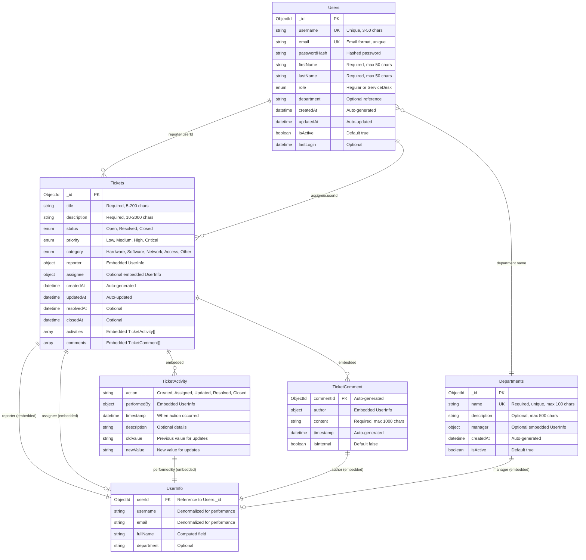

# Visual ERD Diagram - Incident Management System

## Entity Relationship Diagram (Mermaid Format)

## Collection Statistics (Meeting Requirements)

| Collection | Document Count | Status |
|-----------|---------------|---------|
| Users | 150 | ✅ Exceeds minimum 100 |
| Tickets | 200 | ✅ Exceeds minimum 100 |
| Departments | 10 | ✅ Complete organizational structure |
| **Total** | **360** | ✅ **Requirements exceeded** |

## Index Strategy Visualization

## Data Flow Architecture

## Design Decision Summary

### ✅ Embedding Strategy
- **User info in tickets**: Performance optimization for frequent queries
- **Activities in tickets**: Never accessed independently
- **Comments in tickets**: Contextual data access

### ✅ Indexing Strategy
- **Unique constraints**: Username, email uniqueness
- **Query optimization**: Compound indexes for dashboard queries
- **Search functionality**: Text indexes for content search

### ✅ Collection Design
- **Users**: Authentication and profile management
- **Tickets**: Core incident tracking with embedded data
- **Departments**: Organizational reference data

---

*This ERD represents the complete database design for the Incident Management System NoSQL project, meeting all requirements for Deliverable 1.*